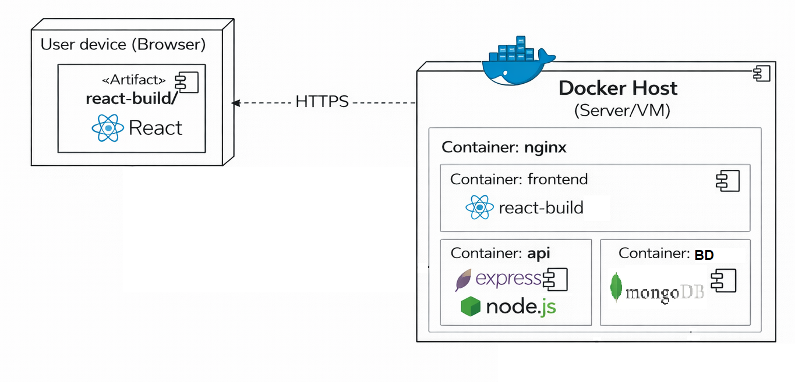
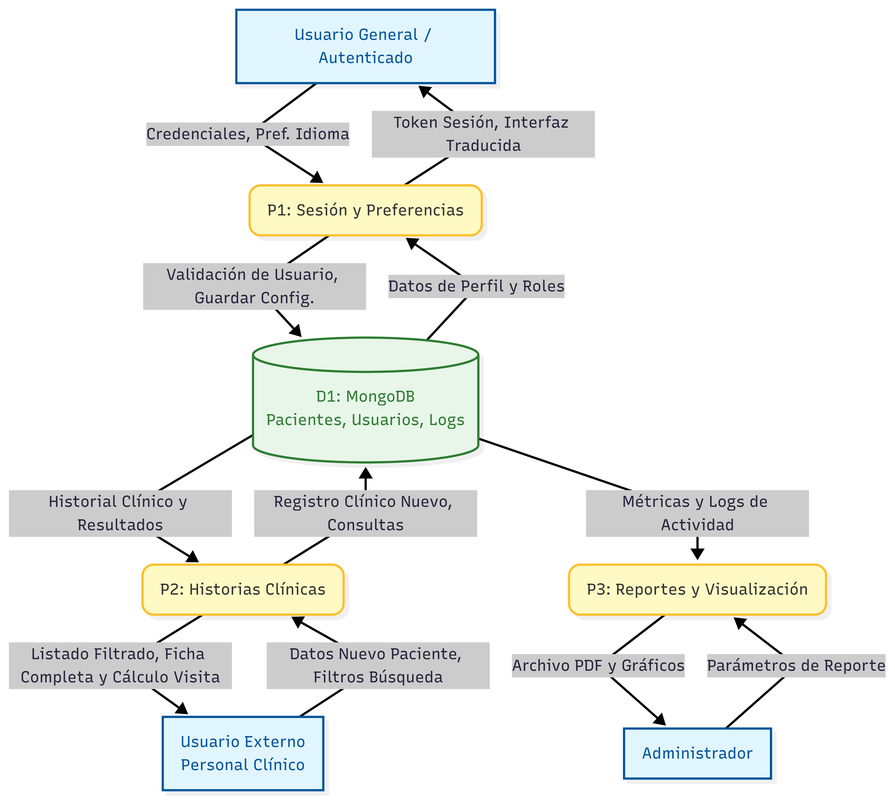

# ati-dental  
Software de gestión de historias clínicas hecho en React  
Proyecto final – ATI II  

---

## 📌 Descripción General

**ati-dental** es una aplicación web orientada a la gestión de historias clínicas odontológicas.  
Permite registrar pacientes, administrar consultas, almacenar tratamientos y consultar historiales clínicos de manera segura.

El sistema se desarrolló siguiendo una arquitectura cliente-servidor, utilizando tecnologías modernas del ecosistema JavaScript.

---

## 🏗️ Arquitectura General

La solución está compuesta por tres capas principales:

- **Frontend:** Aplicación React (Client-Side)  
- **Backend:** API REST desarrollada con Node.js y Express  
- **Base de datos:** MongoDB  

---

## 🧩 Diagrama de Componentes

### Descripción

- **Aplicación Client-Side (React):** Interfaz de usuario y lógica de presentación.  
- **API Backend (Node.js + Express):** Lógica de negocio y controladores.  
- **Sistema de Base de Datos (MongoDB):** Persistencia de datos clínicos.

---

## 🚀 Diagrama de Despliegue

### Descripción

- El usuario accede mediante un navegador web.  
- El frontend se sirve desde un contenedor Docker.  
- El backend se ejecuta en un contenedor independiente.  
- La base de datos MongoDB corre en su propio contenedor.  
- Un contenedor Nginx actúa como servidor web y proxy inverso.

---

## 🔄 Diagrama de Flujo de Datos

---

## ⚙️ Tecnologías Utilizadas

- React  
- Node.js  
- Express  
- MongoDB  
- Docker  
- Nginx  
- JavaScript  
- Git / GitHub  

---

