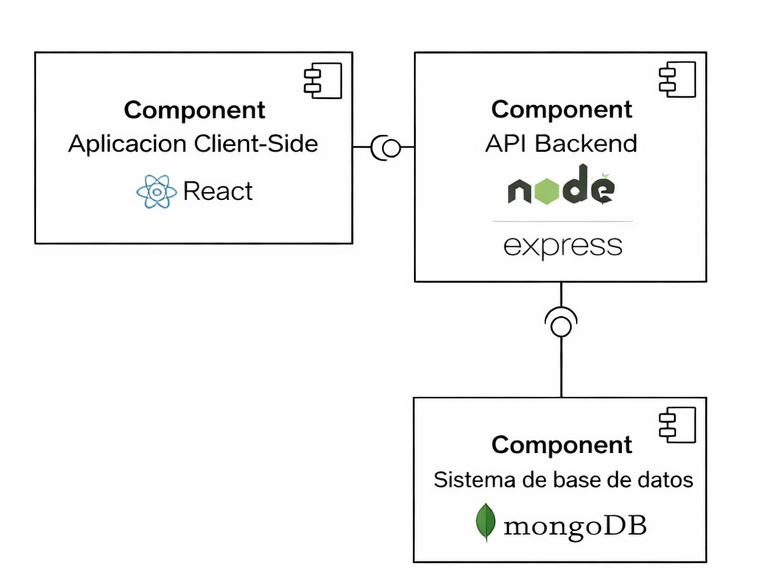
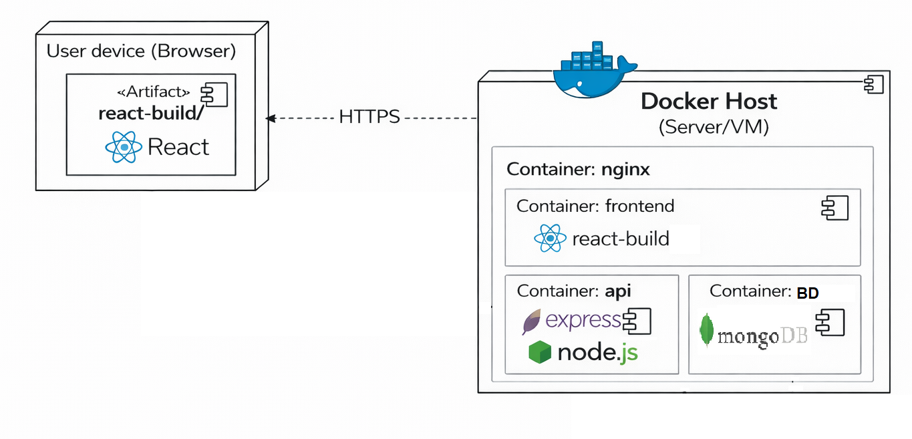
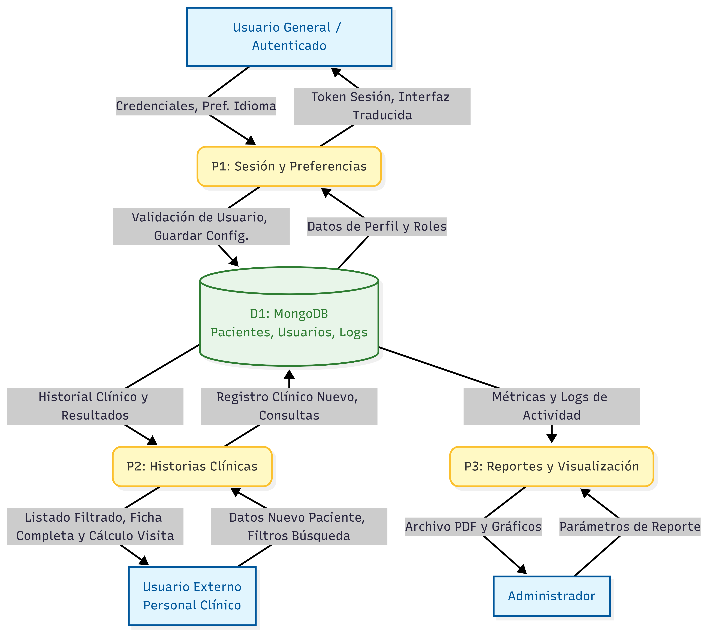

# ati-dental  
Software de gestión de historias clínicas hecho en React  
Proyecto final – ATI II  

---

## 📌 Descripción General

**ati-dental** es una aplicación web orientada a la gestión de historias clínicas odontológicas.  
Permite registrar pacientes, administrar consultas, almacenar tratamientos y consultar historiales clínicos de manera segura.

El sistema se desarrolló siguiendo una arquitectura cliente-servidor, utilizando tecnologías modernas del ecosistema JavaScript.

---

## 🏗️ Arquitectura General

La solución está compuesta por tres capas principales:

- **Frontend:** Aplicación React (Client-Side)  
- **Backend:** API REST desarrollada con Node.js y Express  
- **Base de datos:** MongoDB  

---

## 🧩 Diagrama de Componentes



### Descripción

- **Aplicación Client-Side (React):** Interfaz de usuario y lógica de presentación.  
- **API Backend (Node.js + Express):** Lógica de negocio y controladores.  
- **Sistema de Base de Datos (MongoDB):** Persistencia de datos clínicos.

---

## 🚀 Diagrama de Despliegue



### Descripción

- El usuario accede mediante un navegador web.  
- El frontend se sirve desde un contenedor Docker.  
- El backend se ejecuta en un contenedor independiente.  
- La base de datos MongoDB corre en su propio contenedor.  
- Un contenedor Nginx actúa como servidor web y proxy inverso.

---

## 🔄 Diagrama de Flujo de Datos



---

## ⚙️ Tecnologías Utilizadas

- React  
- Node.js  
- Express  
- MongoDB  
- Docker  
- Nginx  
- JavaScript  
- Git / GitHub  

---

## Entorno de Desarrollo

1. Para desarrollar y ver los cambios en tiempo real, ejecuta el comando:
```bash
docker compose -f docker-compose.dev.yml up
```

2. El frontend será accesible desde http://localhost:5173/, el backend desde http://localhost:5000/ y la base de datos desde localhost:27017. Cualquier cambio en el backend o frontend se verá reflejado en tiempo real.

## 💾 Carga Inicial de Datos (Seeders)

Si levantaste el entorno de desarrollo usando `docker-compose.dev.yml` y necesitas poblar la base de datos con información inicial para pruebas, puedes ejecutar los *seeders* disponibles. 

Para ejecutar los scripts, abre una terminal y corre los comandos utilizando el contenedor `dev_api`:

1. **Crear usuario administrador de prueba**  
   Crea un usuario con rol *admin* para probar el login.
   ```bash
   docker exec dev_api node seedUser.js
   ```

2. **Cargar pacientes de prueba**  
   Popula la colección de pacientes con datos de ejemplo.
   ```bash
   docker exec dev_api node seedPatients.js
   ```


## Jenkins

1. Para hacer pruebas y probarlas en un pipeline de Jenkins, hay un compose separado, se ejecuta con:
```bash
docker compose -f docker-compose.jenkins.yml up -d
```

2. Luego de que se haya levantado el entorno, puedes acceder a Jenkins desde http://localhost:8087/.

Si quieres instalar de cero el Jenkins, puedes seguir las instrucciones del archivo que está en jenkins/README.md.